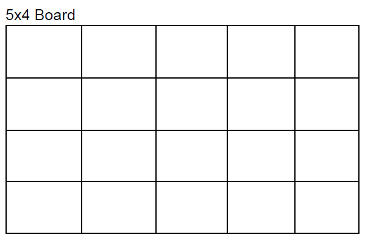
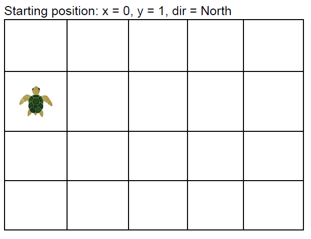
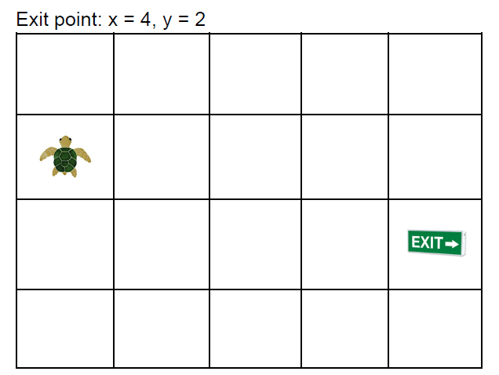

# TurtleChallenge
#### Introduction
- A turtle must walk through a minefield. Given the initial game settings from one file (named `game-settings`) and one or more sequences of moves from a different file (named `moves`), then for each move sequence, the application will output if the sequence leads to the success or failure of the little turtle.

#### Arguments
- The application accepts two files where the `first` is the settings file (named `game-settings`) and the `second` is the moves file (named `moves`). Both files are delimited by a character.

#### Files Layouts (Inputs)
- `game-settings`
    - example: `5x4;0,1;north;4,2;0,2|2,0|2,2|4,3|4,0`
    - delimiter: `;`
    - positions (indexes), examples and meanings:
        - `0`: board size - The board is a square of n by m number of tiles: `5x4`
        
        - `1`: starting position - The starting position is a tile (x,y): `0,1`
        - `2`: initial direction - Initial direction the turtle is facing: `north`,`east`,`south`,`west`
        
        - `3`: exit point - The exit point is a tile (x,y): `4,2`
        
        - `4`: mines - The mines are defined as a list of tiles (x,y). They are delimited by `|`: `0,2|2,0|2,2|4,3|4,0`

- `moves`
    - example:
    `m,r,m,r,m,m,m,r,r,r,m,m,r,r,r,m,r,m,m`
    `m,r,m,r,m,r,r,r,m,m,m,r,m,r,r,r,m`
    `m,r,m,r,m,m,m,r,m,r,m`
    - delimiter: `,`
    - Turtle actions can be either a move (`m`) one tile forward or rotate (`r`) 90 degrees to the right.
    - The file can handle one or more sequences of moves. Each line is a sequence.

#### Outputs
- The possible outputs are:
    - `Success!`: Turtle's reached the exit successfully
    - `Mine hit!`: Turtle's reached a mine
    - `Moved off the board!`: Turtle's moved off the board
    - `Still in danger!`: No more moves to make

#### How to run the app
- At the app root there are both files `game-settings` and `moves` where you may setup according to the instructions above.
- Once configured you may run by Visual Studio in debug mode.
- You may also run by `.exe` or `.dll` file following the steps:
    - Build solution
    - Open `cmd` or `powershell` and go to the directory `..\TurtleChallenge.App\bin\Debug\net6.0`
    - Running `.exe` file using the command: `TurtleChallenge.App.exe game-settings moves`
    - Running `.dll` file using the command: `dotnet TurtleChallenge.App.dll game-settings move`